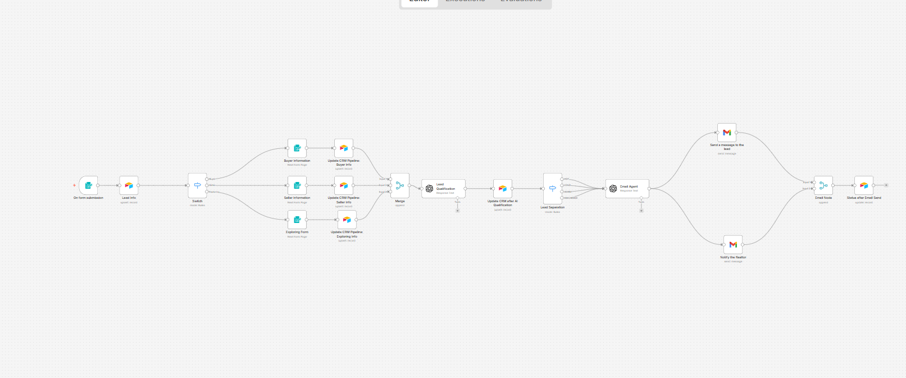

# Lead Automation Workflow

This project contains an automated lead processing workflow that:

- Captures incoming leads
- Classifies and enriches data
- Routes based on conditions
- Sends notifications via email
- Stores structured data in CRM

---

## 🧠 Workflow Overview

1. **Trigger**
   - Runs on form submission

2. **Lead Intake**
   - Captures incoming lead data

3. **Switch Logic**
   - Routes leads based on type:
     - Buyer
     - Seller
     - Exploring

4. **CRM Updates**
   - Updates lead information accordingly

5. **Lead Qualification**
   - Evaluates lead quality

6. **Separation Logic**
   - Splits high vs low priority leads

7. **Email Automation**
   - Sends email to:
     - Lead
     - Realtor

8. **Final Storage**
   - Saves processed data

---

## 📸 Workflow Diagram

---

---

## ⚙️ How to Use

1. Import the JSON file into your automation tool
2. Configure:
   - Email credentials
   - CRM API keys
3. Activate the workflow
4. Test with sample input

---

## 📄 JSON File

The full workflow configuration is available here:

[Download workflow.json](./workflow.json)

---

## 🛠 Requirements

- Automation platform (e.g., n8n, Make, Zapier, etc.)
- Email integration (Gmail / SMTP)
- CRM system (optional)

---

## 🚀 Notes

- Make sure credentials are securely stored
- Validate lead data before processing
- Monitor logs for failures

---

## 📬 Contact

For questions or improvements, open an issue or contribute.
